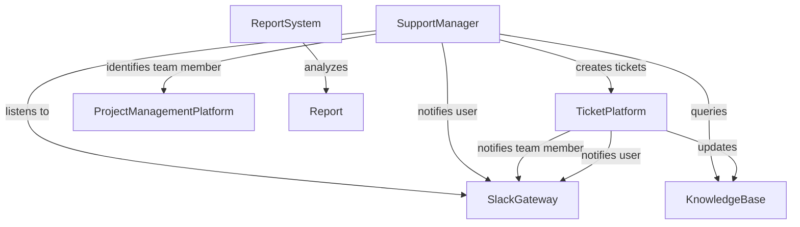

# Example: Slack-ClickUp Support Automation

## Problem statement

Transform chaotic requests and questions into an easy intake process and a knowledge base that grows itself based on your teams expertise.

https://zapier.com/templates/details/helpdesk-automation-template-slack-clickup

## Steps

1. User submits support request through Slack using a simple command or form
1. AI chatbot analyzes the request and checks against your knowledge base for instant solutions
1. Common issues get resolved immediately with step-by-step instructions sent directly to the user
1. Complex or unrecognized requests automatically create tickets in ClickUp with proper categorization
1. System assigns priority levels and routes tickets to appropriate team members based on expertise and workload
1. Team members receive Slack notifications with all relevant context and can update status directly
1. Automated status updates keep users informed throughout the resolution process
1. Resolved tickets automatically update the knowledge base with new solutions for future reference
1. System generates reports on common issues, resolution times, and team performance metric

## System objects and relationships

