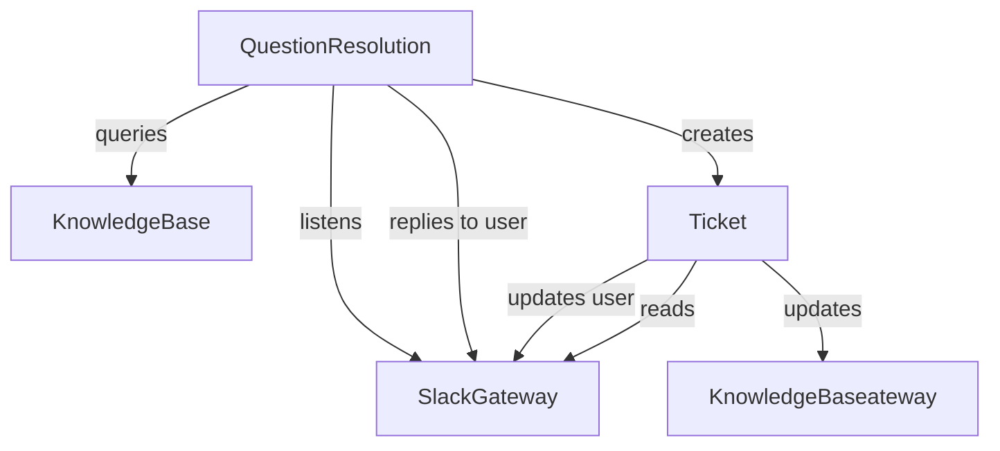

# Example: Slack-ClickUp Support Automation

## Problem statement

Transform chaotic requests and questions into an easy intake process and a knowledge base that grows itself based on your teams expertise.

https://zapier.com/templates/details/helpdesk-automation-template-slack-clickup

## Steps

1. An employee posts a question in a designated Slack channel"
1. AI automatically searches your FAQ knowledge base (stored in a Zapier table) for relevant answers
1. If AI finds a suitable answer, an AI chatbot replies to the employee directly in Slack
1. If AI can't find a good answer—or if the issue requires human attention—the request gets escalated to an IT team member
1. Employees can mark the urgency of their requests using an emoji that corresponds to predefined priority options
1. The system automatically creates tickets in Jira or ClickUp and sends status updates back to Slack
1. After each ticket gets closed out, the system summarizes the Slack thread and adds it to your FAQ database
1. Next time someone has the same question, AI will have the info to respond automatically

## System objects and relationships

